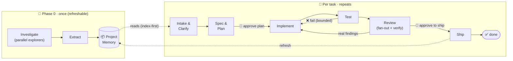

<div align="center">

# 🏗️ SDLC Harness

**A portable, gated software development life cycle for AI coding agents — shipped as a single Claude Code skill.**

Understand the codebase once, then drive every task through a repeatable, human‑gated lifecycle: **intake → spec & plan → implement → test → review → ship**.


</div>

---

## ✨ Why

AI coding agents are great at *writing code* and bad at *process*: they skip clarification, forget project conventions, ship untested changes, and re‑learn the codebase every session. The SDLC Harness gives an agent a **repeatable lifecycle** with human checkpoints, bounded fix‑loops, adversarial review, and a durable **Project Memory** — so the same disciplined flow runs on every task, in any repo.

- 🧠 **Understands your codebase first** — Phase 0 fans out explorers and writes durable Project Memory.
- 🚦 **Human gates where they matter** — approve the plan, approve the ship. Configurable per task.
- 🔁 **Bounded loops** — Implement⇄Test until green; Review→Implement for real findings only.
- 🎚️ **Tracks** — a feature gets the full treatment; a hotfix gets a fast, safe path.
- 📦 **Portable** — one skill, **zero** third‑party dependencies, **zero** Workflow‑tool reliance. Just Node ≥ 18.

---

## 🔄 The lifecycle



Two invariants no path may drop: **a test proves the change**, and **Ship refreshes Project Memory** (so it never goes stale).

---

## 📦 Install

**Via the skills CLI** (recommended):

```bash
npx skills add ultima95/sdlc-harness
```

**Or as a Claude Code plugin:**

```text
/plugin marketplace add ultima95/sdlc-harness
/plugin install sdlc-harness@ultima95
```

Then **restart Claude Code** so the `sdlc` skill is picked up. Requires Claude Code + **Node.js ≥ 18**.

---

## 🚀 Commands

| Command | What it does |
| --- | --- |
| `/sdlc init` | 🧠 Investigate the repo and build **Project Memory** in `.sdlc/memory/`. |
| `/sdlc task "<request>"` | 🎫 Take an issue / bug / feature from intake all the way to shipped. |
| `/sdlc status` | 📋 List tasks and their current phase / gate state. |
| `/sdlc resume [<YYYYMMDD>/<slug>]` | ⏯️ Resume a paused task at its saved phase. |
| `/sdlc memory-refresh` | ♻️ Re‑run Phase 0 to refresh Project Memory. |

---

## 🎚️ Tracks

The `track` scales *which phases run* and *how heavy the gates are* — auto‑suggested from the task type, overridable at intake.

| Track | Intake | Spec & Plan | Test | Review | Gates |
| --- | --- | --- | --- | --- | --- |
| **full** *(feature)* | brainstorm | full spec | full | fan‑out + verify | both **hard** |
| **fast** *(bug / chore)* | 1–3 questions | light spec | ✓ | single‑pass | spec soft, review hard‑lite |
| **hotfix** *(urgent)* | confirm + repro | one‑liner | **regression test (never skipped)** | quick self‑review | both **soft** |

---

## 🧭 How it works

- **One skill, on‑demand guides.** A slim `SKILL.md` conductor dispatches sub‑commands and loads only the current phase guide from `phases/` — context stays lean.
- **Inline agent fan‑out.** Phase 0 explorers and Review reviewers/verifiers are dispatched inline via the Agent tool — no Workflow‑tool dependency, fully portable.
- **Deterministic core, tested.** The mechanical parts — slug/date naming, state & gate transitions, bounded loop counters, findings dedupe + majority‑verdict, memory rendering — are dependency‑free Node scripts with **52 unit tests**.
- **Everything is files.** `.sdlc/` holds `config.yml`, `memory/*.md`, and `tasks/<YYYYMMDD>/<slug>/` (`spec.md` · `progress.md` · `review.md` · `state.json`) — git‑versioned and resumable.

```text
skills/sdlc/
├── SKILL.md              # conductor: init · task · status · resume · memory-refresh
├── phases/               # understand · intake · spec-plan · implement · test · review · ship
├── agents/               # explorer · reviewer · verifier  (inline subagent roles)
├── scripts/              # deterministic, unit-tested Node helpers (+ lib/)
└── templates/            # config.yml, spec/progress/review, memory/*
```

---

## ⚙️ Configuration

`.sdlc/config.yml` (created by `/sdlc init`) controls the harness per repo:

- **`project`** — `build` / `test` / `lint` commands
- **`gates`** — `spec_plan` & `review`: `hard | soft | off`
- **`tracks.default_by_type`** — which track each task type starts on
- **`loops`** — `max_test`, `max_review` (bounded fix‑loops)
- **`review`** — `dimensions` + `verify: adversarial`
- **`ship`** — `mode: commit | pr`
- **`memory`** — `graph: auto|on|off`, `refresh: on_ship|manual`

---

## 🧪 Development

```bash
npm test    # runs the Node unit tests for the bundled scripts (52, zero deps)
```

---

## 📐 Design

This repo carries its own provenance — the full design spec and every milestone's implementation plan live under [`docs/`](docs/) ([specs](docs/specs/) · [plans](docs/plans/)). Built brainstorm → spec → per‑milestone plans → subagent‑driven execution with two‑stage review.

<div align="center"><sub>Built with Claude Code · gated, tested, portable.</sub></div>
